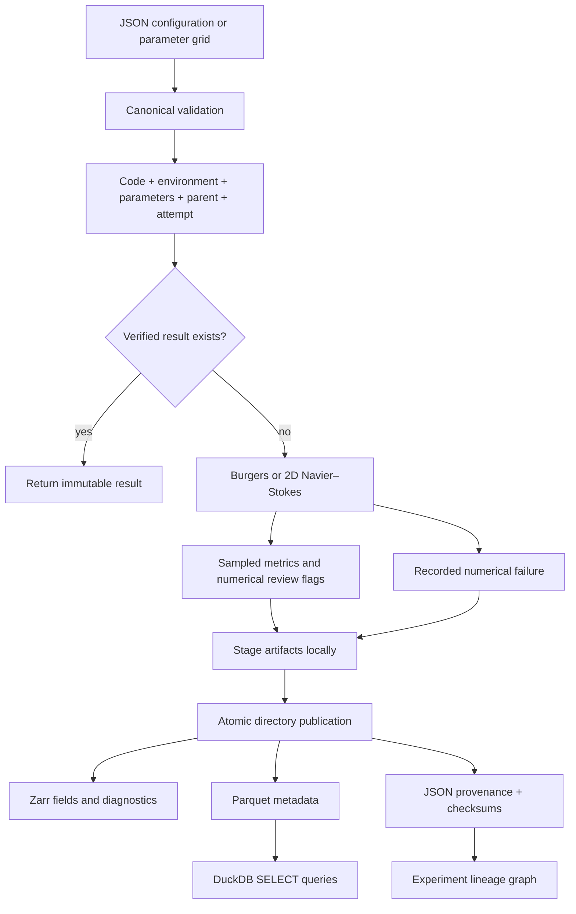

# Engine architecture

Flowstate connects a scientific question to executable configurations and retained
evidence. The first version implements the numerical experiment and data layer.



## Modules

| Module | Responsibility |
| --- | --- |
| `numerics.py` | Strict config validation, initial conditions, integration, saved fields and diagnostics |
| `engine.py` | Execution identity, provenance, metric summaries, attempts, process-based sweeps |
| `lake.py` | Atomic publication, Zarr arrays, Parquet catalog, SQL, checksums, lineage |
| `cli.py` | JSON commands, readable failures, machine-readable output and exit status |
| `darcy.py` | Manufactured steady Darcy problems and a sparse harmonic-face solve |
| `validation.py` | Refinement studies, measured resources, NPZ evidence and a JSON report |
| `streaming.py` | Saved-frame callback writing Zarr chunks during integration |
| `datasets.py` | Verified extraction, compatible-grid ETL, family splits, HDF5 import |
| `ml.py` | CPU FNO/PINN training, checkpoint resumption, physical evaluation metrics |
| `object_store.py` | Conditional immutable S3 objects and verified download publication |
| `research.py` | Typed graph, explicit assertions, budgeted refinement policy |
| `demo.py` | Reproducible integration study with stage-level JSONL events |

There is no central writable metadata database. A DuckDB connection builds the
`experiments` table from the per-run Parquet records, so distinct workers can publish
without competing over a database writer lock. Temporary staging directories are
hidden from discovery. A crash before publication leaves no finalized run; a later
invocation starts that configuration again. Power-loss durability and remote object
storage transactions are outside this local prototype's guarantees.

## On-disk contract

```text
data/lake/experiments/<id>/
  record.json
  metadata.parquet
  manifest.json
  fields.zarr/          # completed numerical runs only
    time
    coordinates/x
    coordinates/y      # 2D only
    fields/...
    diagnostics/...
```

Field arrays use a saved-time leading axis. Burgers uses `(time, x)` and Navier–Stokes
uses `(time, y, x)`. Frames are chunked individually, with spatial chunks capped at
64 cells per dimension. The initial and final states are saved, even when the final
step is not divisible by `save_every`. Diagnostics align with the saved times.

The engine uses 128-bit identifiers derived from SHA-256 over the canonical config,
parent ID, attempt, schema version, source fingerprint, Git commit, dependency/Python
versions, and recorded hardware. Run timestamps are excluded. Changing source,
commit, environment, machine description, or attempt creates a distinct experiment.
An existing result is checksum-verified before reuse, including existing failures.
After numerical failure, use a new attempt or corrected configuration; linking the
new run to its predecessor is explicit with `--parent`.

Git dirty state and a package source fingerprint are recorded. A fingerprint can
identify changed code but cannot reconstruct it. For exact reproduction, commit the
source and retain `uv.lock`; avoid relying on uncommitted code. Hardware information
does not capture every floating-point library or scheduling detail, so portability
does not imply bitwise equality.

The manifest detects accidental damage. It is unsigned, and directory permissions
do not enforce immutability against external modification. `verify` is explicit for
analysis and automatic for resumption; SQL does not rehash every field chunk.

## Scientific entities

The default graph command exports experiment nodes and `parent_of` edges for a
compact lineage view. `graph --ontology` adds scientific entity types, versioned
explicit assertions, model/data relations, and evidence links.

The expanded graph now implements explicit typed entities and evidence links in
`research/entities/`, reconstructed together with the experiment-derived nodes.
FNO/PINN bundles carry dataset/checkpoint hashes and can be registered. The
deterministic refinement policy generates hypotheses and proposals, and executing
a bounded cycle records observational findings. It never automatically promotes
them to proof or claims of scientific support. See [the stepbook](../STEPBOOK.md)
for the exact pipeline and [learning chapter](steps/04-learning-baselines.md) for
the data split and checkpoint contract.

The scientific reviewer has a separate role: challenge numerical validity,
provenance, benchmark splits, and interpretation. Review flags are numerical
observations, not accepted hypotheses. Future agents should propose bounded
experiments with compute budgets; they should never silently promote an observation
into a scientific finding.
