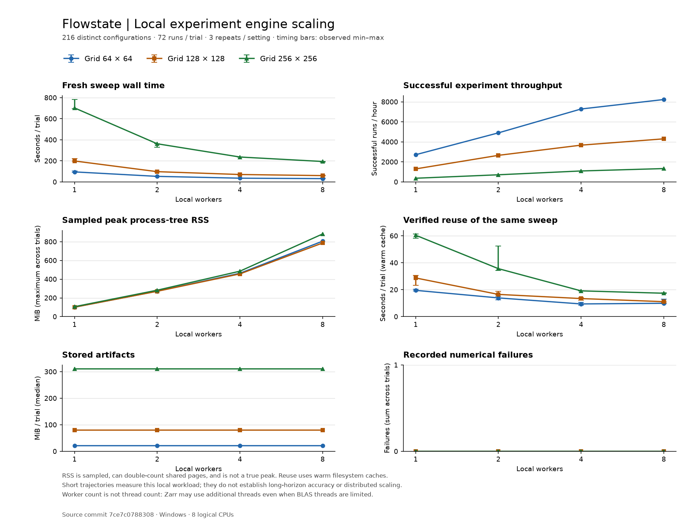

# Milestone 1: measure the local experiment loop

The question is how quickly this computer can solve, store, and verify a fixed
workload, and whether additional workers help. The workload deliberately uses
short trajectories. It measures data infrastructure and execution overhead; it
does not establish long-time physical accuracy or distributed capacity.

## Reproduce the study

Prepare the optional plotting dependency and the locked environment:

```sh
uv sync --locked --all-extras --group dev
```

Use a clean checkout of the **source commit recorded in the retained report**.
After preparation, this one command produces both the report and chart:

```sh
uv run --no-sync flowstate scaling-study outputs/scaling-large-01
```

The directory must not exist. Another run needs a new name. A nonsynchronized
local disk directory is preferable if the repository lives in OneDrive. The
report records the actual output path. Different hardware, dependencies, storage,
or background load can produce different timings; repeatability means executing
the same recorded protocol, not promising identical timing numbers.

The command requires clean committed code and checks free disk space before
starting. It reserves estimated output space plus scratch and metadata headroom,
then checks a minimum remaining reserve between trials. It never deletes old
results. It uses local computation and does not access cloud credentials.

## Workload and interpretation

The exact normalized configurations and execution order are in `plan.json` and
the final report. The fixed protocol uses grids 64, 128, and 256, workers 1, 2, 4,
and 8, and three repeats of each combination. There are 72 configurations per grid:
36 initial-condition seeds crossed with two viscosities. That is 216 distinct
configurations, not 216 per grid or 216 independent trajectory families.

Each configuration solves periodic, unforced, two-dimensional Navier–Stokes with
the existing dealiased vorticity solver, amplitude 0.5, viscosities 0.02 and 0.05,
timestep 0.00025, and 32 integration steps. Streaming saves the initial frame,
step 16, and step 32. The physical interval is short; these are throughput inputs,
not a turbulence study. The protocol performs 2,592 fresh executions and then
2,592 verified reuse requests. These are protocol counts, not measured successes.

All grid/worker/repeat combinations are shuffled together with a fixed order
seed. Each trial has its own interpreter and fresh lake. The child environment
sets the common BLAS/OpenMP thread limits to one; Zarr and other I/O can still use
threads. OS caches are not flushed.

## What the program does

1. `cli.main()` dispatches `scaling-study` directly to
   `scaling_study.run_scaling_study()` without constructing an unrelated lake.
2. `study_plan()` builds each parameter grid with `expand_sweep()` through the
   bounded planner. Its loops enumerate grids, seeds, viscosities, workers, and
   repetitions before any solver starts. Existing small-benchmark limits remain
   unchanged; the new protocol explicitly opts into the larger bounded planner.
3. The orchestrator writes the plan, checks the source identity, and writes one
   request file per trial. `_isolated_trial()` launches a fresh Python process.
4. `_execute_case()` times `run_sweep()`. The engine normalizes each configuration,
   computes its content identity, solves it, writes chunked Zarr fields, derives
   diagnostics, writes Parquet/JSON metadata, hashes the artifacts, and publishes
   the immutable experiment. A sampler observes the parent and descendant memory.
5. The audit loop verifies every manifest and computes scientific-array hashes.
   The same sweep runs again against that lake; this timing measures verified
   reuse rather than another solve. Failed numerical runs are also verified and
   reused, with their error preserved and no nonexistent fields read.
6. For each grid, the orchestrator compares scientific values, identities, and
   review flags across every worker count and repeat. Disagreement or storage
   failure prevents a completed-study claim. Infrastructure errors retain a
   failed report, event log, partial artifacts, and available child diagnostics.
7. `_summary()` groups trials by grid and worker count. It calculates medians,
   ranges, serial-relative speedups, and counts without mixing different grids.
   `render_scaling_chart()` plots only these retained measurements.

This is an ETL workflow: **extract** run records, manifests, fields, timing, memory,
and filesystem sizes; **transform** them into verified fingerprints and grouped
statistics; **load** immutable JSON reports and a PNG chart. Raw fields remain in
their per-trial lakes, outside Git. Compact reports and the chart are retained in
`docs/reports/` after the study finishes.

## Reading the evidence

- **Wall time:** includes worker startup, solving, writing, hashing, and publication.
  Extra audit reads, reuse, and the outer interpreter startup are excluded.
- **Runs/hour:** counts successful experiments. Attempted throughput is separate;
  fast numerical failures never masquerade as successful solves.
- **Memory:** sampled sum of process-tree resident memory. Shared pages may be
  counted repeatedly and short peaks may be missed. Inspect sampling errors too.
- **Stored bytes:** logical lengths of committed artifacts, excluding scratch,
  filesystem allocation overhead, and study reports.
- **Verified reuse:** immediate warm-cache replay, including pool startup and
  checksum work. Reuse is not guaranteed to be faster than these short solves.
- **Failures:** numerical-failure counts and errors remain visible. Infrastructure
  faults abort the study and preserve a failed report rather than hiding trials.

The graph shows median wall/reuse times with observed min/max ranges. Three
repeats describe local variability; they do not establish statistical significance.
The study keeps slowdowns and other negative results. Long trajectories, chunk
layout tuning, other equations, remote storage, and distributed workers are not
measured by this protocol.

## Executed results

The [retained report](../reports/scaling-large.json) and
[validation receipt](../reports/scaling-large-validation.json) record the study
executed from clean commit `7ce7c07883080d7cf676ed8512727c28bdb19732` on
4 October 2026. It completed all 36 trials: 2,592 successful fresh executions and
2,592 verified reuses, with no numerical failures or sampled review flags.
Scientific array hashes, identities, and flags agree across worker counts and
repetitions within each grid. This equality checks execution consistency, not
physical accuracy.

The actual command used an unsynchronized local output directory:

```sh
uv run --no-sync flowstate scaling-study C:/Users/yuvis/AppData/Local/Flowstate/scaling-large-20261004
```

That directory is retained and cannot be reused as a fresh destination. The
generic command above reproduces the protocol in a new directory. Source
fingerprints hash actual checkout bytes: line-ending policy can change the
fingerprint and experiment IDs even when program logic is unchanged. The
validation receipt records the observed checkout/Git line-ending differences.
Match code, dependencies, hardware, and checkout bytes when comparing identities;
cross-machine byte-identical experiment IDs are not promised.

Each row below summarizes three trials of 72 runs. Fresh wall time, throughput,
reuse time, and artifact size are medians. Memory is the maximum sampled
process-tree RSS across the three trials; failures are summed.

| Grid | Workers | Fresh seconds | Successful runs/hour | Sampled RSS MiB | Reuse seconds | Stored MiB/trial | Failures |
| --- | --- | --- | --- | --- | --- | --- | --- |
| 64 | 1 | 95.32 | 2719 | 101.1 | 19.53 | 21.59 | 0 |
| 64 | 2 | 52.88 | 4902 | 271.8 | 13.91 | 21.59 | 0 |
| 64 | 4 | 35.57 | 7286 | 463.3 | 9.44 | 21.59 | 0 |
| 64 | 8 | 31.48 | 8233 | 805.9 | 9.94 | 21.59 | 0 |
| 128 | 1 | 199.06 | 1302 | 101.0 | 28.73 | 79.78 | 0 |
| 128 | 2 | 97.58 | 2656 | 270.9 | 16.52 | 79.78 | 0 |
| 128 | 4 | 70.53 | 3675 | 456.5 | 13.43 | 79.78 | 0 |
| 128 | 8 | 60.20 | 4305 | 786.4 | 11.12 | 79.78 | 0 |
| 256 | 1 | 703.05 | 369 | 106.3 | 60.47 | 310.85 | 0 |
| 256 | 2 | 362.44 | 715 | 282.4 | 35.64 | 310.85 | 0 |
| 256 | 4 | 236.65 | 1095 | 485.5 | 19.14 | 310.85 | 0 |
| 256 | 8 | 194.18 | 1335 | 883.0 | 17.39 | 310.85 | 0 |



The complete command took 154.23 minutes, including the extra audit, fingerprint,
and reuse passes. Committed experiment artifacts total 5,187,028,945 logical bytes
(4.83 GiB); this excludes filesystem allocation overhead and study reports.
Raw fields remain outside Git. The JSON and PNG in `docs/reports/` are exact copies
of the generated artifacts, with their hashes retained in the validation receipt.
Git attributes disable newline conversion for the retained JSON so generated
bytes and artifact hashes survive subsequent checkouts.

The negative findings matter. Doubling from four to eight workers improved fresh
throughput by only 13.0%, 17.2%, and 21.9% for the respective grids, while sampled
peak RSS increased by 74.0%, 72.3%, and 81.9%. On the small grid, median reuse was
slightly slower with eight workers: 9.94 seconds versus 9.44 seconds with four.
The ranges overlap, so this is an observed result, not a statistically established
regression. More workers were not an equally efficient improvement for every
part of the workflow.

Memory sampling observed 117 process-disappearance errors across 112 partial
samples out of 153,293 samples; there were no access-denied or unexpected sampler
errors. Helpers can exit while being sampled, so the result remains a sampled
estimate rather than an exact memory ceiling. Short trajectories, warm caches,
one host, and a narrow workload limit extrapolation. Zero observed failures is
not evidence that arbitrary inputs or long simulations will succeed.

Validation passed 451 tests with four Windows symbolic-link permission skips,
plus Ruff and the Windows/Linux CI jobs for the measured source commit. A
post-study DuckDB query also retrieved all 72 completed records from a largest-grid
trial. The receipt preserves the checks, counts, source identity, and CI links.
